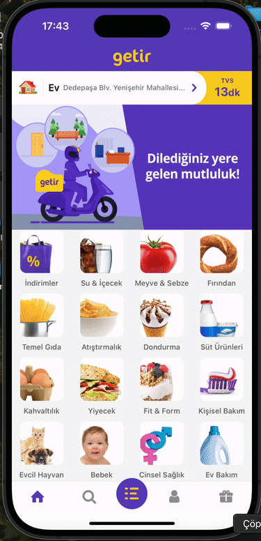

# Getir Clone Project 🛒

This project is a **Getir Clone**, a mobile-based e-commerce application where users can browse products, add them to their cart, and manage their purchases.

---

## Features ✨

- **User-Friendly Navigation**: Powered by React Navigation with stack and bottom tab navigators.
- **Redux Integration**: State management with Redux and asynchronous actions using Redux Thunk.
- **Dynamic Product Management**: Add/remove products from the cart.
- **Category Filtering**: Users can easily browse through product categories.
- **Persisted State**: Cart and user actions managed efficiently.
- **Smooth Animations**: Utilizes `react-native-reanimated` for interactive UI elements.

---

## Technologies and Libraries Used 🛠️

The project was built using the following tools and libraries:

- **React Native**: Core framework for building the mobile app.
- **React Navigation**: Handles navigation and routing between screens.
  - `@react-navigation/bottom-tabs`
  - `@react-navigation/native`
  - `@react-navigation/stack`
- **Redux**: State management for the application.
  - `redux`
  - `react-redux`
  - `redux-thunk`
  - `redux-logger`
  - `redux-devtools-extension`
- **Animations and Gestures**:
  - `react-native-reanimated`
  - `react-native-gesture-handler`
- **UI and Icons**:
  - `react-native-vector-icons`
- **Utilities**:
  - `react-native-safe-area-context`
  - `react-native-screens`

# rn-getir-clone
